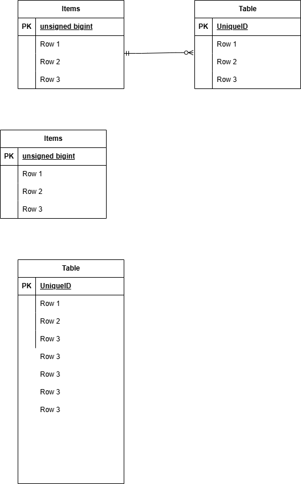

# coachtech フリマアプリ

## 概要

COACHTECH模擬案件として作成するフリマアプリです

### Dockerビルド

git clone git@github.com:tanao1120/nao-fleamarket.git
cd nao-fleamarket
docker compose up -d --build

### Laravel環境構築

docker compose exec php bash
composer install
cp .env.example .env
php artisan key:generate
php artisan migrate

### 使用技術（実行環境）

PHP 8.1.34
Laravel 8.83.8
MySQL 8.0.26
Nginx 1.21.1
Docker / Docker Compose
Laravel Fortify

### URL
開発環境：http://localhost/
phpMyAdmin：http://localhost:8080/

### データベース

データベース名：laravel_db

### テーブル一覧

- users
- items
- categories
- category_item
- likes
- comments
- purchases

## ER図

