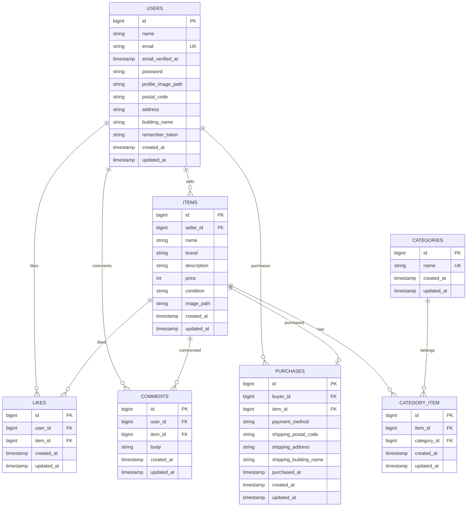

# ER図

```mermaid
erDiagram
    USERS ||--o{ ITEMS : sells
    USERS ||--o{ LIKES : likes
    USERS ||--o{ COMMENTS : comments
    USERS ||--o{ PURCHASES : purchases

    ITEMS ||--o{ LIKES : liked
    ITEMS ||--o{ COMMENTS : commented
    ITEMS ||--o| PURCHASES : purchased

    ITEMS ||--o{ CATEGORY_ITEM : has
    CATEGORIES ||--o{ CATEGORY_ITEM : belongs

    USERS {
        bigint id PK
        string name
        string email UK
        timestamp email_verified_at
        string password
        string profile_image_path
        string postal_code
        string address
        string building_name
        string remember_token
        timestamp created_at
        timestamp updated_at
    }

    ITEMS {
        bigint id PK
        bigint seller_id FK
        string name
        string brand
        string description
        int price
        string condition
        string image_path
        timestamp created_at
        timestamp updated_at
    }

    CATEGORIES {
        bigint id PK
        string name UK
        timestamp created_at
        timestamp updated_at
    }

    CATEGORY_ITEM {
        bigint id PK
        bigint item_id FK
        bigint category_id FK
        timestamp created_at
        timestamp updated_at
    }

    LIKES {
        bigint id PK
        bigint user_id FK
        bigint item_id FK
        timestamp created_at
        timestamp updated_at
    }

    COMMENTS {
        bigint id PK
        bigint user_id FK
        bigint item_id FK
        string body
        timestamp created_at
        timestamp updated_at
    }

    PURCHASES {
        bigint id PK
        bigint buyer_id FK
        bigint item_id FK
        string payment_method
        string shipping_postal_code
        string shipping_address
        string shipping_building_name
        timestamp purchased_at
        timestamp created_at
        timestamp updated_at
    }
```